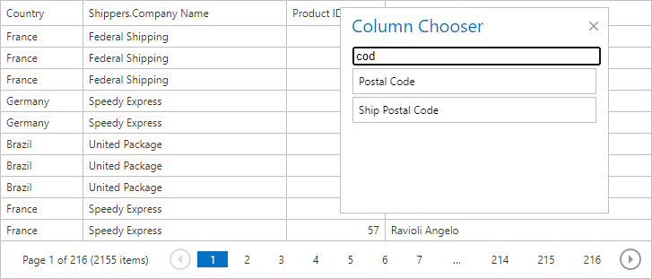

<!-- default badges list -->

[](https://supportcenter.devexpress.com/ticket/details/T591169)
[](https://docs.devexpress.com/GeneralInformation/403183)
[](#does-this-example-address-your-development-requirementsobjectives)
<!-- default badges end -->

# Grid View for ASP.NET Web Forms - How to implement search in the column chooser window

This example demonstrates how to add an input element to the column chooser window and use it to filter columns in the window.
	


## Implementation Details

Create an input element and append it to the column chooser DOM elements.

```js
var _createElement = function (tag, parent) {
	var element = document.createElement(tag);
	if (parent)
		parent.appendChild(element);
	return element;
}
 that.appendToDom = function () {
	var tr = _createElement("tr");
	tr.id = containerID;
	var td = _createElement("td", tr);
	var inputContainer = _createElement("div", td);
	inputContainer.id = extensionID;
 	var inputElement = _createElement("input", inputContainer);
	inputElement.type = "text";
	inputElement.onchange = that.onchange;
	inputElement.value = that.lastValue;
	if (inputElement.value)
		inputElement.onchange();
 	var parent = that._getTable();
	parent.insertBefore(tr, parent.children[0]);
}
```

To correctly append the input element to the column chooser window, handle the client `Init` and `EndCallback` events and add the input element there.

Handle the `onchange` event and search for a typed value through the html table that contains field names.

```js
that.onchange = function () {
	var newText = this.value.toLowerCase();
	var children = that._getTable().children;
	for (var i = 0, l = children.length; i < l; i++) {
		var _tr = children[i];
		if (_tr.id == containerID)
			continue;
		_tr.classList.remove(hideClass);
		
		var _tds = [];
		_findChildren(_tr.children, "td", _tds)
 		var hasText = _tds.filter(function (item) {
			return item.textContent.toLowerCase().indexOf(newText) > -1
		}).length > 0;
		if (!hasText)
			_tr.classList.add(hideClass);
	}
	that.lastValue = newText;
}
```

Hide a row with a field name that doesn't contain the typed text by setting a specific CSS class to the row element.


```css
tr.cw-hide {
	display: none;
}
```

## Files to Review

* [AppClientCode.js](./CS/AppClientCode.js) (VB: [AppClientCode.js](./VB/AppClientCode.js))
* [Default.aspx](./CS/Default.aspx) (VB: [Default.aspx](./VB/Default.aspx))
<!-- feedback -->
## Does this example address your development requirements/objectives?

[](https://www.devexpress.com/support/examples/survey.xml?utm_source=github&utm_campaign=asp-net-web-forms-grid-search-in-column-chooser&~~~was_helpful=yes) [](https://www.devexpress.com/support/examples/survey.xml?utm_source=github&utm_campaign=asp-net-web-forms-grid-search-in-column-chooser&~~~was_helpful=no)

(you will be redirected to DevExpress.com to submit your response)
<!-- feedback end -->
